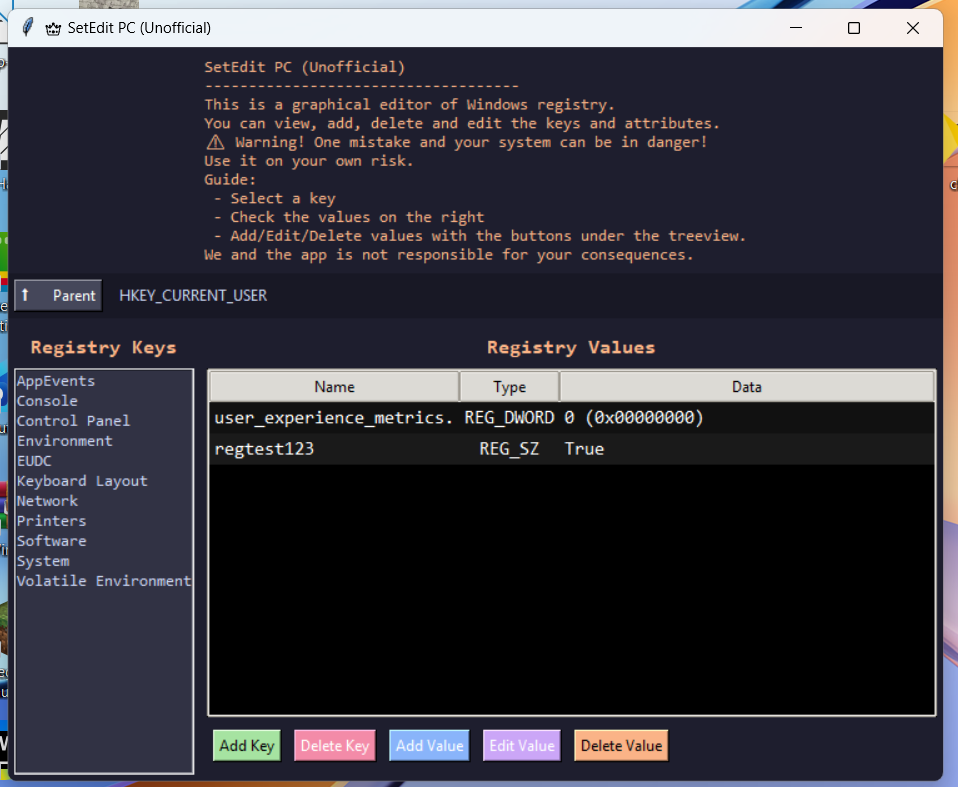

> # SetEdit PC (Unofficial)
> 
> 
> 
> **SetEdit PC** is a graphical Windows Registry editor inspired by the **SetEdit** app on Android, but fully functional on Windows with a Tkinter-based GUI.
> 
> > ⚠️ **Warning:** Incorrect registry modifications can damage your system. Use at your own risk.
> 
> ---
> 
> ## Features
> 
> - Browse all Windows Registry keys (HKEY_CURRENT_USER and subkeys).  
> - Add, edit, and delete **keys and values**.  
> - Supports all main registry value types:
>   - `REG_SZ`
>   - `REG_EXPAND_SZ`
>   - `REG_MULTI_SZ`
>   - `REG_DWORD`
>   - `REG_BINARY`
> - Dark theme with Consolas font for easy reading and editing.  
> - Dynamic window: Treeview expands and buttons are always visible.  
> - Double-click a value to open the edit dialog.  
> 
> ---
> 
> ## Installation and Running
> 
> 1. Clone the repository:
> 
> ```bash
> git clone https://github.com/CyberPlugger/SetEdit-PC.git
> cd SetEdit-PC
> ```
> 
> 2. Make sure you have Python (3.10+) installed and `tkinter` available.  
> 
> 3. Run the application:
> 
> ```bash
> python SetEdit.py
> ```
> 
> Alternatively, you can use the compiled `.exe` built with PyInstaller.
> 
> ---
> 
> ## How to Use
> 
> 1. Select a key from the **Registry Keys** list on the left.  
> 2. View values of the selected key in **Registry Values** on the right.  
> 3. Use the buttons to manage registry keys and values:
>    - **Add Key** — add a new key.  
>    - **Delete Key** — delete the selected key.  
>    - **Add Value** — add a new value.  
>    - **Edit Value** — edit the selected value.  
>    - **Delete Value** — delete the selected value.  
> 4. Use the **⬆️ Parent** button to go up one level in the key hierarchy.
> 
> ---
> 
> ## Warning
> 
> - Any changes to the registry may damage Windows.  
> - It is recommended to backup keys before editing.  
> - Use this application only for testing or local system configuration.
> 
> ---
> 
> ## Requirements
> 
> - Windows 10 or higher  
> - Python 3.10+  
> - `tkinter` module (usually included with Python)
> 
> ---
> 
> ## License
> 
> This project is provided as-is without any license. Use at your own risk.
> 
> ---
> 
> ## Contact
> 
> - Author: **[CyberPlugger]**  
> - GitHub: [https://github.com/CyberPlugger](https://github.com/CyberPlugger)
